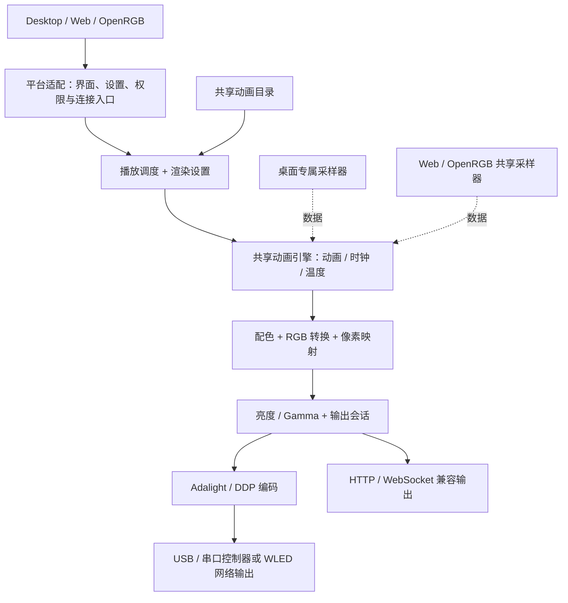

# Pixel Studio 0.2.0 - Modular architecture / 模块化架构升级

Release date / 发布日期：2026/10/02

## Architecture / 架构

This is a logical responsibility diagram; actual browser, Desktop and OpenRGB connection implementations remain platform-specific.

这是职责分层图，浏览器、桌面和 OpenRGB 的实际连接实现仍保留各自的平台边界。

## Changes / 本版改动

- Shared animation registry and catalog for 96 built-in modes. 动画绘制与目录从 HTML 中分离，共享引擎管理 96 个内置模式。
- Independent clock drawing, render settings, frame mapping and palette processing. 时钟绘制、渲染参数、像素排列及配色处理拥有明确模块边界。
- DOM-free headless rendering. 后台直接调用共享引擎，不再读取页面源码或模拟网页控件。
- Separate browser media/preview, playback/timing and output adapters. 网页运行时拆分媒体预览、播放计时与连接输出，入口保留控件事件及模块组装。
- Separate Adalight/DDP encoding and Node USB/DDP connection lifecycle. 协议编码与连接的启动、发送、停止分离。
- Packaging allowlists and simulated regression coverage updated for the new modules. 打包资源白名单及模拟回归检查同步补齐。
- Redesigned shared Web/Desktop interface with consistent gallery cards, selection rings, rounded scrolling surfaces, edge fades and bilingual controls. 更新网页与桌面界面，统一卡片、选中强调框、圆角滚动底框、边缘淡入淡出及双语控件。
- Desktop media library: folder selection, search, thumbnails, manual refresh and folder watching. Added Animation/Media switching and timed shuffle while preserving 15:27 card proportions. 桌面新增媒体库，支持选择文件夹、搜索、缩略图、手动刷新和文件夹监听；动画/媒体切换及定时随机播放保留 15:27 卡片比例。
- Low-resolution image/video thumbnails use crisp pixel scaling; high-resolution thumbnails use smooth scaling. Media is proportionally maximized, centered and letterboxed without stretching. 低分辨率图片/视频按像素图清晰缩放，高清素材平滑缩放；桌面媒体默认保持比例、居中最大化并补黑边，不拉伸。
- Full filenames appear directly on hover/focus without an intermediate truncated-name state or resizing the card. 悬停或聚焦时直接显示完整文件名，不先显示短名称再展开，不改变卡片尺寸。
- Preview and device output are independent: stopping output does not stop or restart the preview timeline; starting output uses the current frame. Static images remain in the playing state for the selected interval. 预览与设备输出分离：停止输出不暂停或重置预览，启动输出使用当前帧；图片播放期间保持静态画面及播放状态，按设置间隔切换。
- Corrected media replacement, idle shuffle, output status flicker, asynchronous cancellation and OpenRGB animation switching after output starts. 修正媒体切换、停止输出后的随机切换、输出状态闪烁、异步取消，以及 OpenRGB 开始输出后无法切换动画的问题。
- Desktop media-session restoration and connection restoration have independent ownership. Remembered USB selection does not depend on choosing an animation rather than media. 桌面媒体会话恢复与连接恢复各自负责，记住串口不再依赖当前选择的是动画还是媒体。
- Reduced hidden-window preview redraw and PNG encoding work without intentionally stopping device output. 减少后台窗口预览重绘及 PNG 编码开销，不主动停止设备输出；未提供实际 CPU 降幅保证。
- Web/Desktop default theme follows the system for new profiles; existing preferences are preserved. Fixed application, installer and Sensor icons use ice blue, retaining approved Logo geometry. 新用户的网页/桌面主题默认跟随系统，保留已有偏好；应用、安装包及 Sensor 固定图标使用冰蓝色，认可的 Logo 造型不变。
- Updated credits include GPT-6.1 Sol. OpenRGB About dates use YYYY/MM/DD; About and update checks identify version 0.2.0. 协作成员加入 GPT-6.1 Sol；OpenRGB 关于日期统一为 YYYY/MM/DD，关于和更新检查同步为 0.2.0。
- Removed retired-name migration fingerprints and dead compatibility branches; corrected Desktop startup after removing obsolete media UI, and completed source archive module lists. 移除旧名称数字指纹及无效兼容分支，修复精简旧媒体 UI 后的桌面启动错误，并补齐源码归档模块清单。
- Fresh three-in-one installer provides Web, Desktop and OpenRGB components with retained dependency notices. 新三合一安装包提供网页、桌面及 OpenRGB 组件，保留随包依赖声明。

## Preserved behavior / 保留的行为

- Approved Logo geometry/glow, bilingual behavior and four separate temperature cards. 保留认可的 Logo 造型与泛光、中英文切换，以及四张独立温度动画卡片。
- Desktop owns its sampler; Web/OpenRGB share a separate sampler. 桌面专属采样器与 Web/OpenRGB 共享采样器的所有权不变，动画渲染不接管采样生命周期。
- Existing connection and device-color detection policies remain. 保留既有连接及设备颜色检测规则，不新增未知设备 Gamma 推测。
- Compatible PawnIO reuse and separate installation consent remain. 保留兼容 PawnIO 复用与独立授权流程，不关闭 Fan Control 或修改风扇设置。

## Validation and acceptance / 验证与验收

Source and simulated checks passed, including 960 exact local pre-refactor frame hashes, browser/Node frame agreement, 100 rapid worker animation updates, mocked browser bootstrap/playback/serial handshake, protocol/resource checks, and language/settings/updater regressions. Local fixtures are not captures from a released binary or physical display. An older 1,900-frame fixture includes explicitly documented capture-time jitter; it is not an all-frame exact-time equivalence claim.

源码与模拟检查已通过，包括 960 帧本地修改前基准精确哈希、浏览器与 Node 帧一致性、100 次工作线程快速动画切换、模拟网页启动/播放/串口握手，以及协议、资源、语言、设置和更新器回归。本地基准不是已发布二进制或灯屏实测；更早的 1,900 帧记录含明确记录的采集计时误差，不能宣称全部精确时间匹配。

TEST packages were compiled and installed by the user, who reported normal operation after the fixes. Isolated Desktop-page startup and mocked session/resource/language checks passed. These results do not certify every device, upgrade path or resolution. Final compatibility cleanups are source- and build-checked; no new physical-device run is claimed for the final binaries.

已编译 TEST 包，用户安装后反馈修复后的版本运行正常；桌面页面隔离启动以及会话、资源、语言模拟检查通过。以上不代表全部设备、升级路径或分辨率均已验收；最终兼容代码精简按源码与构建核对，不声称最终二进制已重新进行灯屏实测。

No new controller protocol, universally adaptive artwork or measured CPU/FPS improvement is promised. Existing unknown/newer PawnIO versions are not automatically replaced. Back up settings and fully exit Desktop/OpenRGB before upgrading.

本版不承诺新控制器协议、所有分辨率自动适配或已量化的 CPU/FPS 提升。已有未知或更新版本的 PawnIO 不自动覆盖。升级前请备份设置，并从托盘完全退出桌面版/OpenRGB。

## Artwork rights and contact / 动画素材权利与联系

If you are a rights holder or an authorized representative and believe that an animation or artwork included in Pixel Studio infringes your rights, please contact the maintainer through [GitHub Issues](https://github.com/OW3N-HE/Pixel-Studio/issues). Please identify the animation, the relevant rights and the basis of your claim. After reviewing the notice, we will take appropriate action, which may include removal or replacement of the material. Please do not post private documents or personal information in a public issue; you may first request a private contact channel. This notice does not imply official endorsement or authorization, nor does it replace applicable licenses or permissions.

如您是权利人或其授权代表，认为 Pixel Studio 中的动画或图案涉及侵权，请通过 [GitHub Issues](https://github.com/OW3N-HE/Pixel-Studio/issues) 联系维护者，说明对应动画、相关权利及主张依据。我们会核实通知，并根据核实结果采取下架、删除或替换等适当措施。请勿在公开 Issue 中提交隐私文件或个人信息，可先请求私下联系渠道。本声明不表示获得官方认可或授权，也不代替适用的许可与授权。
